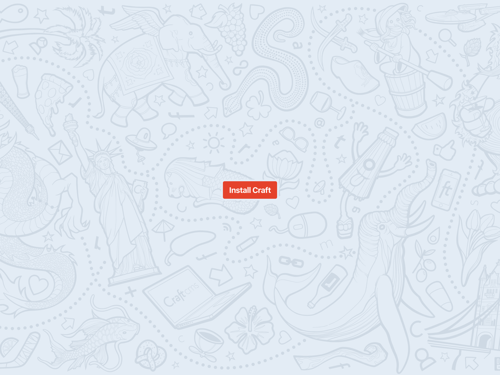

# Finish setup

We already know you’re on the right track if visiting your local site URL in your browser gets you a `HTTP 503 – Service Unavailable` response:

<BrowserShot url="http://tutorial.test" :link="false">

</BrowserShot>

This is because Craft isn’t installed and doesn’t have anything to show to normal visitors. (And all the detailed output is there because we’re in local development mode.)

But you’re not a normal visitor, you’re an admin.

Visit `https://tutorial.nitro/admin` instead. You should have an **Install Craft** button:

<BrowserShot url="https://tutorial.test/admin/install" :link="false">

</BrowserShot>

::: tip
If you’re getting other errors in your browser, check your environment’s setup guide and make sure you have the right base URL for your site and that the server is running.
:::

If you’ve managed _not_ to push the red button, go ahead!

You’ll be prompted to accept Craft’s license agreement, create your first user account, and set your site’s name, URL and default language.

Now the real fun begins.
