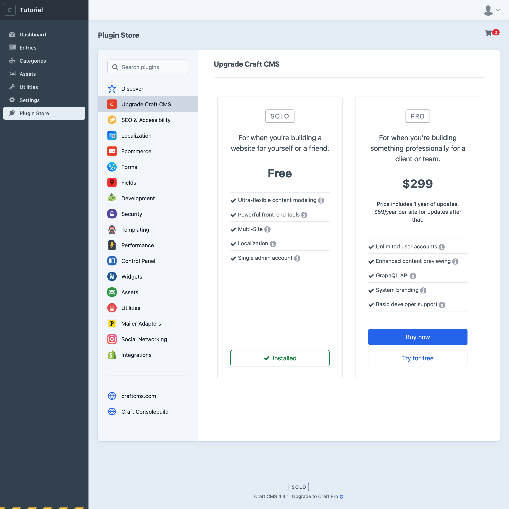
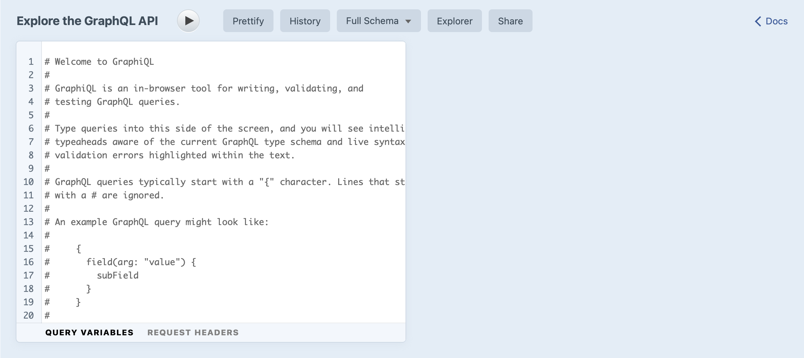
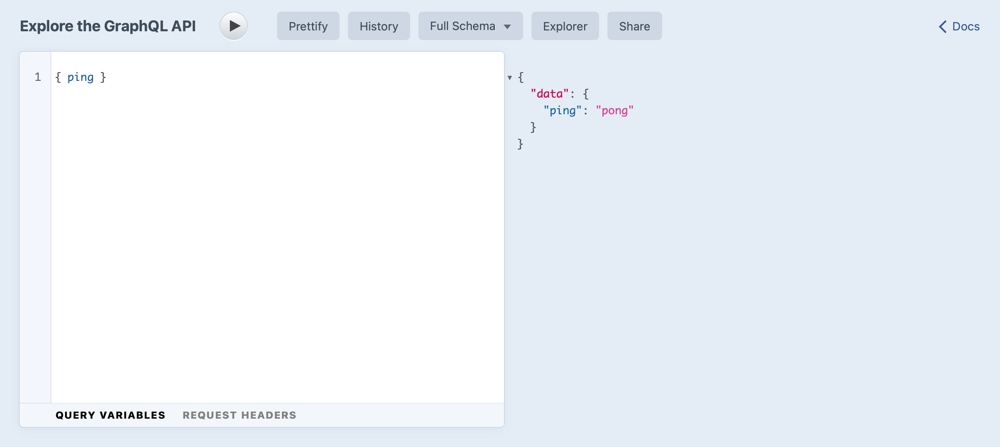

# Headless Mode + GraphQL

You can also use Craft as a headless CMS, meaning your web server handles content management, but an outside application provides the public-facing front end. In this model, server-side Twig templates are not used—instead, you’ll use the built-in GraphQL API to fetch content and render it with whatever client-side view library you or your team is familiar with.

GraphQL support is limited to the Pro edition of Craft. If you’ve already modeled content and used it in Twig templates, the GraphQL API should feel familiar.

::: warning
Building a front end this way requires more development experience than we’ve covered in this tutorial. We’ll only touch on GraphQL basics and recommend more resources.
:::

## Overview

GraphQL is a popular and expressive query language that works well with Craft’s flexible content modeling tools. In most cases, fetching content with GraphQL is analogous to using element queries in Twig—but instead of returning native element objects, the structure and substance of JSON output from the GraphQL is determined by the _client_ rather than the _server_.

## Configure GraphQL

The GraphQL API requires Craft Pro. You can start a Pro trial locally and use it however long you need to evaluate Craft—payment is only required when you start using Craft Pro on a public-facing domain. It’s safe to downgrade any time, if you decide the Solo edition is enough for your needs!

<BrowserShot
  url="https://tutorial.ddev.site/admin/plugin-store/upgrade-craft"
  :link="false"
  :poi="{
    soloBadge: [64, 95],
    tryButton: [89, 72],
  }"
  caption="Upgrading from Solo to Pro.">

</BrowserShot>

To upgrade your installation to Craft Pro:

1. In the control panel, locate the **Solo** badge at the bottom of any screen and click **Upgrade to Craft Pro**;
1. Choose **Try for free** within the <badge type="edition" vertical="middle">Pro</badge> panel of the **Upgrade Craft CMS** page;
1. Refresh the page, or go back to the **Dashboard**;

Once upgraded, a new **GraphQL** item will appear in the main navigation menu. Let’s open the GraphiQL explorer to browse the auto-generated schema and documentation, by clicking **GraphQL**, then **GraphiQL**.

<BrowserShot url="https://tutorial.ddev.site/admin/graphiql" :link="false" caption="The GraphiQL explorer.">

</BrowserShot>

::: tip
[GraphiQL](https://www.electronjs.org/apps/graphiql) is a GUI tool for using the [GraphQL query language](https://graphql.org/). The former is often mistaken for a typo and the difference is subtle!
:::

Clear out the comments in the query editor and try running a simple query:

```graphql
{ ping }
```

You’ll see `pong` in the response pane, signaling that everything’s ready to go:

<BrowserShot url="https://tutorial.ddev.site/admin/graphiql?query=%7B%20ping%20%7D%0A" :link="false" caption="It’s working!">

</BrowserShot>

By default, the Craft CMS GraphiQL interface will use the full “schema” without any restrictions—in other words, it has access to _all content_ through the GraphQL API, including mutations.

To use GraphQL *externally* (without a privileged user session), you’ll need to do two things:

1. [Establish a GraphQL API endpoint](/4.x/graphql.md#setting-up-your-api-endpoint) for querying externally.
2. Either create your own private schema with a secret access token, or edit the public schema to enable querying content without an access token. (By default, the public schema leaves all content disabled.) See [Define Your Schemas](/4.x/graphql.md) in the GraphQL documentation.

## Optional: Enable Headless Mode

If you want to query Craft CMS for content but handle your own routing, you can enable <config4:headlessMode>. This will optimize the installation to hide template settings and route management and return all front end responses as JSON.

To enable headless mode, add this to `config/general.php`:

```php{6}
<?php
use craft\config\GeneralConfig;

return GeneralConfig::create()
    // ...
    ->headlessMode(true)
;
```

## Twig examples as GraphQL queries

Content can be fetched with GraphQL using the same parameters we’ve already used in Twig. Ultimately, Craft is still using [element queries](/4.x/element-queries.md) to decide how data should be loaded.

Let’s retrace each step of the tutorial where we fetched content, seeing how the Twig example maps to a GraphQL query.

### `_layout`

The base template includes the default Craft CMS language, site name, and site description:

- `craft.app.language`
- `siteName`
- `siteInformation.siteDescription`

These aren’t available via the GraphQL API, but if you needed them you could store each in a global set, like we did for the description:

::: code
```graphql Query
{
  globalSet(handle: "siteInformation") {
    ... on siteInformation_GlobalSet {
      siteDescription
    }
  }
}
```
```json Response
{
  "data": {
    "globalSet": {
      "siteDescription": "Hello, world!"
    }
  }
}
```
:::

### `blog/_entry`

The blog post detail template displays an entire blog post with its full content.

- `entry.title`
- `entry.postDate`
- `entry.featureImage`
  - `title`
  - `url`
  - dynamic `getUrl()` transform at 900×600px
- `entry.postContent`
  - `block.type`
  - `block.text`
  - `block.image` Assets field
- `entry.postCategories`
  - `title`
  - `url`
- `siteInformation.siteDescription` processed by Markdown

With the Twig setup, the web server provides its URL to Craft CMS, which uses its routing logic to fetch the entry and make it available as `entry` in the template.

We don’t have routing logic running GraphQL queries, so we’ll query on the known slug `my-trip-to-bend` for this example. Grab any slug from one of your test entries.

We also used `postDate` in two different formats, so we’re using the [GraphQL alias](https://graphql.org/learn/queries/#aliases) `postDateAlt` to return a second format for parity.

```graphql
{
  entry(slug: "my-trip-to-bend") {
    title
    postDate @formatDateTime(format: "d M Y")
    postDateAlt: postDate @formatDateTime(format: "Y-m-d")
    url
    ... on blog_blog_Entry {
      featureImage {
        title
        url
        sized: url @transform(width: 900, height: 600, quality: 90)
      }
      postContent {
        ... on postContent_text_BlockType {
          typeHandle
          text
        }
        ... on postContent_image_BlockType {
          typeHandle
          image {
            title
            url
          }
        }
      }
      postCategories {
        title
        url
      }
    }
  }
  globalSet(handle: ["siteInformation"]) {
    ... on siteInformation_GlobalSet {
      siteDescription @markdown
    }
  }
}
```

You’ll notice that anything with its own field layout implements its own element interface, which is why properties consistent for all element types (`title`, `postDate`, `slug`, etc.) are readily available while custom fields must be queried in the context of a relevant element interface such as everything nested within `... on blog_blog_Entry {}`.

The response should be something like this:

```json
{
  "data": {
    "entry": {
      "title": "My first post",
      "postDate": "20 Mar 2020",
      "postDateAlt": "2020-03-20",
      "url": "https://tutorial.ddev.site/blog/my-trip-to-bend",
      "featureImage": [
        {
          "title": "Craft Image from Unsplash",
          "url": "https://tutorial.ddev.site/assets/blog/tim-gouw-rXBwosfgG-c-unsplash.jpg",
          "sized": "https://tutorial.ddev.site/assets/blog/_900x600_crop_center-center_90_none/tim-gouw-rXBwosfgG-c-unsplash.jpg"
        }
      ],
      "postContent": [
        {
          "typeHandle": "text",
          "text": "<p>Lorem ipsum dolor sit amet, consectetur adipisicing elit, sed do eiusmod tempor incididunt ut labore et dolore magna aliqua.</p>"
        },
        {
          "typeHandle": "image",
          "image": [
            {
              "title": "Little Drinks",
              "url": "https://tutorial.ddev.site/assets/blog/rosie-kerr-Z0iBELYV8uk-unsplash.jpg"
            }
          ]
        },
        {
          "typeHandle": "text",
          "text": "<p>Sed dignissim purus eget lectus bibendum blandit blandit id dui. Ut odio lectus, sodales quis convallis ac, tincidunt in nunc. Integer a est justo, pharetra iaculis turpis. Donec vehicula lorem eu sem condimentum at semper velit fermentum. Phasellus euismod quam vel felis aliquet fringilla. In volutpat diam id purus rutrum vestibulum. Praesent at purus risus, non tristique nibh.</p>\n"
        }
      ],
      "postCategories": [
        {
          "title": "Ramblings",
          "uri": "https://tutorial.ddev.site/blog/category/ramblings"
        }
      ]
    },
    "globalSet": {
      "siteDescription": "<p>This is our tutorial site where we’ve built a blog from scratch with Craft CMS.</p>\n"
    }
  }
}
```

### `blog/index`

The blog listing page displays a thumbnail icon and summary for every entry.

This is fairly straightforward with GraphQL. We’ll expose the custom focal point as well in case the front end might make use of it:

```graphql
{
  entries(section: "blog") {
    title
    url
    ... on blog_blog_Entry {
      featureImage {
        title
        url
        sized: url @transform(width: 300, height: 300)
        focalPoint
      }
    }
  }
}
```

Result:

```json
{
  "data": {
    "entries": [
      {
        "title": "My first post",
        "url": "https://tutorial.ddev.site/blog/my-trip-to-bend",
        "featureImage": [
          {
            "title": "Craft Image from Unsplash",
            "url": "https://tutorial.ddev.site/assets/blog/tim-gouw-rXBwosfgG-c-unsplash.jpg",
            "sized": "https://tutorial.ddev.site/assets/blog/_300x300_crop_center-center_none/tim-gouw-rXBwosfgG-c-unsplash.jpg",
            "focalPoint": [0.2059, 0.6287]
          }
        ]
      }
    ]
  }
}
```

### `blog/_category`

The blog category listing is the same as the listing layout above, limited to a specific category defined in the page URL.

We’ll use the `relatedTo` query parameter, which requires IDs as its arguments. We can relate to the “Ramblings” category by its ID, which we can get with another GraphQL query or by visiting “Categories” and finding the numeric ID in the control panel URL.

```graphql
{
  categories {
    id
    title
  }
}
```

```json
{
  "data": {
    "categories": [
      {
        "id": "30",
        "title": "Ramblings"
      }
    ]
  }
}
```

If the ID for that category is `30`, the listing query could limit results by that relationship:

```graphql
{
  entries(section: "blog", relatedTo: 30) {
    title
    # ...
  }
}
```

Limiting on more than one category ID, like entries in category `30` or `40`, would be a matter of passing an array:

```graphql
{
  entries(section: "blog", relatedTo: [30, 40]) {
    title
    # ...
  }
}
```

For more on relationship querying, see the [Relations](/3.x/relations.md) page in the Craft CMS documentation.

### `_singles/about`

The about page is a Single, which is sort of a section and an entry and can be queried either way; using the `section` or `slug` parameter with a value of `about`.

- `entry.title`
- `entry.aboutImage`
- `entry.postContent`
  - `block.type`
  - `block.text`
  - `block.image` Assets field

```graphql
{
  entry(section: "about") {
    title
    ... on about_about_Entry {
      aboutImage {
        title
        url
      }
      postContent {
        ... on postContent_text_BlockType {
          typeHandle
          text
        }
        ... on postContent_image_BlockType {
          typeHandle
          image {
            title
            url
          }
        }
      }
    }
  }
}
```

Result:

```json
{
  "data": {
    "entry": {
      "title": "About",
      "aboutImage": [
        {
          "title": "Floating in Space",
          "url": "https://tutorial.ddev.site/assets/general/nasa-Yj1M5riCKk4-unsplash.jpg"
        }
      ],
      "postContent": [
        {
          "typeHandle": "text",
          "text": "<p>Lorem ipsum dolor sit amet, consectetur adipiscing elit. Phasellus nibh quam, consequat et pellentesque non, malesuada vulputate risus. Donec et nisi sit amet nisi aliquam pulvinar. Pellentesque habitant morbi tristique senectus et netus et malesuada fames ac turpis egestas. Vestibulum hendrerit neque tincidunt massa tempus cursus dictum diam vulputate. Morbi aliquet, mi ut aliquam varius, nunc augue pellentesque felis, nec blandit sapien nunc vitae odio. Vivamus pretium metus sit amet urna iaculis id accumsan massa tincidunt. Maecenas posuere nibh id magna porta ullamcorper. Nunc tortor velit, tincidunt sit amet dapibus at, lacinia ac sem. Cum sociis natoque penatibus et magnis dis parturient montes, nascetur ridiculus mus. Proin feugiat iaculis sem ac blandit. Integer dignissim lacinia dolor eu elementum.</p>\n<p>Sed dignissim purus eget lectus bibendum blandit blandit id dui. Ut odio lectus, sodales quis convallis ac, tincidunt in nunc. Integer a est justo, pharetra iaculis turpis. Donec vehicula lorem eu sem condimentum at semper velit fermentum. Phasellus euismod quam vel felis aliquet fringilla. In volutpat diam id purus rutrum vestibulum. Praesent at purus risus, non tristique nibh.</p>\n<p>Quisque rutrum, dolor id viverra varius, odio libero dapibus augue, ac semper felis quam a dolor. Praesent sagittis quam et justo consequat luctus. Fusce posuere augue nec ipsum rhoncus id vestibulum libero consectetur. Etiam luctus ultricies neque, at viverra est tincidunt mollis. Nam sollicitudin sollicitudin gravida. Class aptent taciti sociosqu ad litora torquent per conubia nostra, per inceptos himenaeos. Ut non sem a tortor ultricies fringilla. Nam ac velit nulla, eu ullamcorper tellus. Donec interdum hendrerit nisi, et tempus dolor pulvinar at. Mauris lacinia sollicitudin est vitae rutrum. Nullam ullamcorper interdum bibendum.</p>"
        }
      ]
    }
  }
}
```

## Explore GraphQL further

As with the Twig examples, we’re just scratching the surface of ways you can fetch content with Craft CMS.

See the [GraphQL API](/3.x/graphql.md) section of the Craft CMS documentation to learn more about working with GraphQL.

You may also want to check out our [blog starter project](https://github.com/craftcms/starter-blog) that includes an example Craft CMS + [Gatsby](https://www.gatsbyjs.org/) integration.
