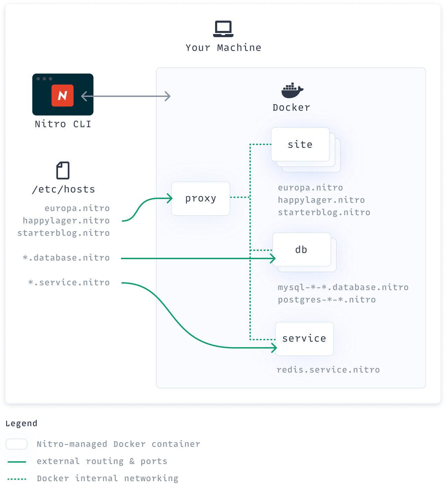
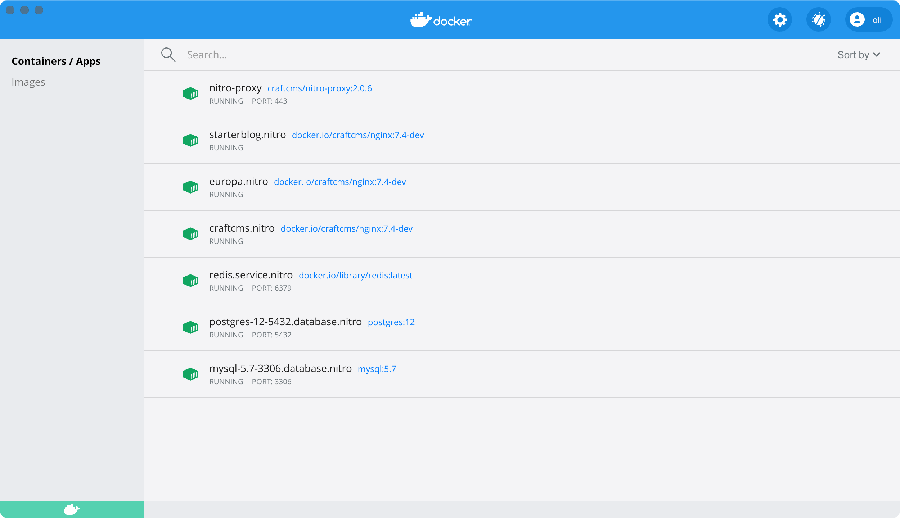

# How Nitro Works

Nitro lets you get working with Docker without having to learn Docker.

## Nitro & Docker

It helps to be familiar with containers and Docker concepts if you get into advanced customization, but all Nitro requires is that you [install Docker](installation.md).

You can add [your own Docker images](containers.md), but if you want to fully Dockerize your development workflow Nitro may not be for you. (But Docker or [Docker Compose](https://docs.docker.com/compose/) might be!)

::: tip
If you run your own Docker setup, you’re welcome to use the official [Craft CMS Docker images](https://github.com/craftcms/docker) Nitro relies on.
:::

The benefit is you can leave your code exactly as it is; Nitro doesn’t add any dependencies or require you to store devops configuration in your repository—just the ephemeral path and database credentials you’d set in any environment.

## Docker Performance

Unless you’re on Linux, Docker Desktop runs in a virtual machine on your system. Docker’s performance and resource usage depends heavily on your machine specs and Docker settings, so we recommend [a bit of performance tuning](README.md#recommended-docker-resources) for the best experience.

Nitro is built to utilize resources efficiently, with small container sizes, shared database engines and services, and design decisions that try to be respectful of its footprint.

## Architecture

### CLI & Docker

The Nitro CLI is [a Go app](https://github.com/craftcms/nitro) that’s compiled into a binary for your OS. When you run `nitro` commands, Nitro acts like a concierge to manage Docker containers for local development.

### Hosts & Networking

Nitro attempts to edit your machine’s hosts file so you can use its custom domain names externally, like accessing a site in a browser or connecting a GUI app to one of the database engines. These external routes and ports [are customizable](customizing.md) so you can avoid port conflicts on your machine.

You can open Docker Desktop to see the containers Nitro creates for you. They’re distributed like a tiny datacenter with its own internal networking and meant to be safely running simultaneously.

A big architectural change for Nitro 2 was the addition of the proxy container that routes requests to each of your sites. This listens on port 80 and 443 by default and reverse-proxies the site containers, providing TLS and preventing port collisions as you run multiple sites simultaneously.

### Sites

Each site has its own PHP, Git, and npm+node version and can be independently configured to use [Xdebug](xdebug.md) or customized PHP [settings](php-settings.md) or [extensions](extensions.md). It exposes ports 8080, 9000, and 9003 to the proxy, which you can reach via the hostname on ports 80 (http) and 443 (https) from your host machine.

### Databases

Each database engine has its own container and can host however many databases you need.

You can access a database container from your host machine using its hostname and *external* port, while you’ll need to use its hostname and *internal* port when referencing it from inside a container. (Typically this will be the default port like 3306 for MySQL or 5432 for Postgres, regardless of the external port being used.)

A database engine’s hostname includes version and connection details. We can tell from `postgres-12-5433.database.nitro`, for example, that we have Postgres 12 running on a non-standard external port (5433 instead of 5432). From a GUI app like TablePlus on our host machine, we’d connect with that hostname using port 5433. Our `.env` file within a web container, however, would use the exact same hostname and the default port 5432.

### Services

Like database engines, each service will have its own container that may be shared by other sites. You can use `nitro container` to add or remove [your own Docker container](containers.md). Its custom hostname will follow the pattern with database and service containers.

### Updating

When you [update the Nitro CLI](updating.md) with [`nitro self-update`](commands.md#self-update) or `brew upgrade nitro`, you’ll get the latest version with updated code for talking with Docker. Running [`nitro update`](commands.md#update) will check the running containers and rebuild them with freshly-pulled Docker images if necessary so that both the Nitro CLI and the containers it’s working with are completely up to date.