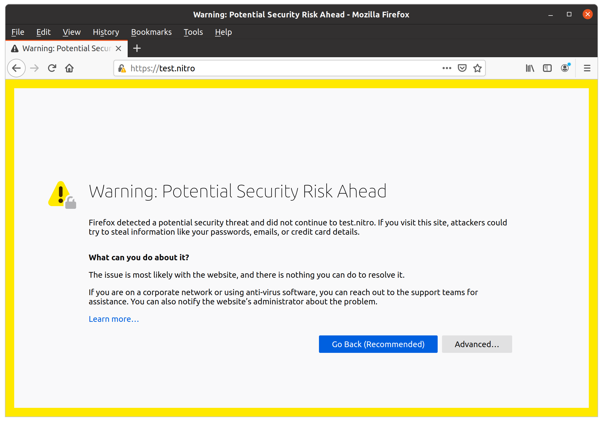
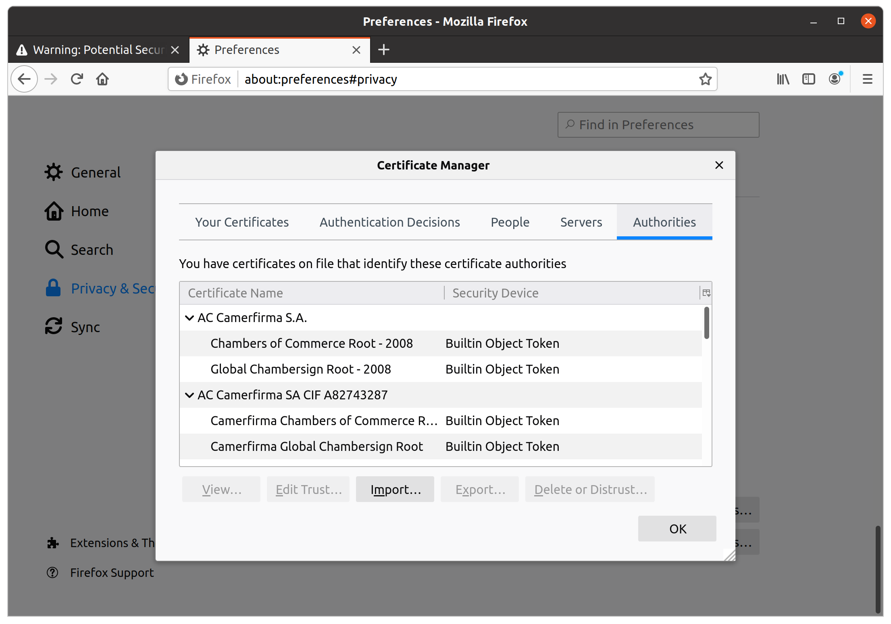

# Nitro on Linux

## Trusting Nitro’s Certificate in Browsers

If you’re getting browser warnings for https Nitro URLs, you’ll need to manually configure the browser to trust the certificate you’ll find in `~/.nitro/nitro.crt`.

### Firefox Example

Firefox will display a warning for your Nitro sites until you’ve told it to trust the root Nitro certificate:\
    

1. Open the **Certificate Manager** by choosing the browser’s settings menu, **Preferences** → **Security & Privacy**, finding the **Certificates** section, and choosing **View Certificates**:\
    

2. Choose **Import...** and browse to the `.nitro` directory inside your home folder. (You may need to enable hidden files.) Select the **nitro.crt** file and choose **Open** to confirm the selection.

3. A dialog will allow you to designate trust purposes. Check **Trust this CA to identify websites.** and choose **OK**:\
    

You should now be able to refresh the tab with the SSL warning and get back to normal:

