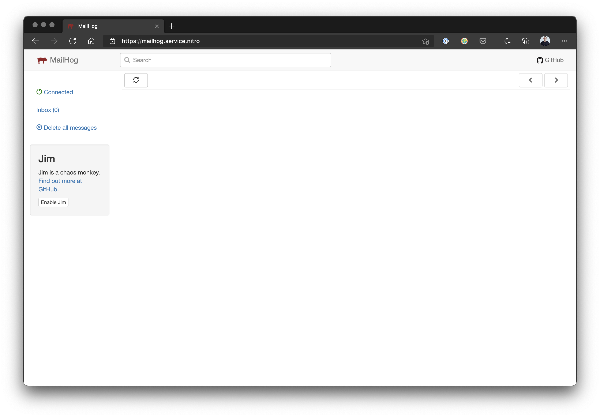

# MailHog

Nitro comes with an easy way to set up and configure MailHog for local email testing. To enable MailHog, run the following command:

## Enabling MailHog

To enable MailHog in Nitro, run the following command:

`nitro enable mailhog`

Nitro will then prompt you to `nitro apply` the changes. After the changes have been applied the MailHog web UI will be available at [https://mailhog.service.nitro](https://mailhog.service.nitro).

### Using MailHog

MailHog’s ready to be used once it’s running, but it doesn’t change any of your mail settings by default. You can tell Craft or any app to send mail using MailHog’s SMTP settings.

From the Craft control panel, visit **Settings** → **Email** and enter the following:

- Transport Type: `SMTP`
- Host Name: `mailhog.service.nitro`
- Port: `1025`
- Use Authentication: Unchecked (default)
- Encryption Method: `None` (default)
- Timeout: `10` (default)

::: tip
Note: The SMTP port 1025 will always be the port to use even if you override the default SMTP port using an environment variable.
:::

## Disabling MailHog

Removing MailHog is as simple as enabling the service. Simply run `nitro disable mailhog` and `apply` the changes. The MailHog service will be removed from Nitro and your hosts file.

## Overiding MailHog Default Ports

::: warning
Make sure the MailHog service is not enabled before overriding the variables.
:::

By default, MailHog uses port 1025 for SMTP and 8025 for the Web UI. These ports may collide with another service on your machine so Nitro includes an easy way to overide the ports. You can set the following environment variables in your terminal shell to override the defaults.

`NITRO_MAILHOG_SMTP_PORT`

`NITRO_MAILHOG_HTTP_PORT`

::: tip
Change these ports only affects the ports on the _host_ machine (aka 127.0.0.1:port) and does not change the internal port used to connect to MailHog from a Craft installation/container.
:::
