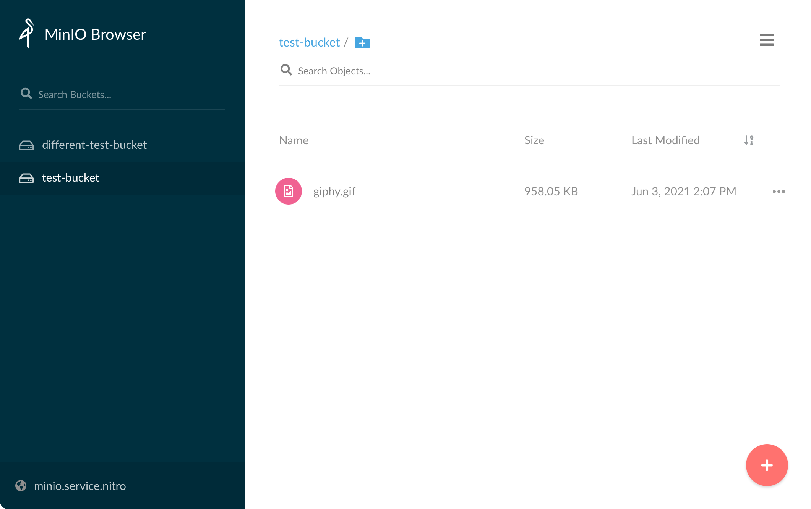

# Minio

Nitro comes with an easy way to setup and configure Minio (a S3 compatible server) for local testing. To enable Minio, run the following command:

## Enabling Minio

To enable Minio in Nitro, run the following command:

`nitro enable minio`

Nitro will then prompt you to `apply` the changes. After the changes have been applied the Mino web UI will be available at [https://minio.service.nitro](https://minio.service.nitro).

The default username and password to access the Minio UI are:

__Username__: `nitro`

__Password__: `nitropassword`

## Using Minio

To use Minio in your Craft project you can configure your compontent to use the following settings:

__Hostname__: `minio.service.nitro`

__Port__: `9000`

::: tip
The port 9000 will always be the port to use when in a sites container, even if you override the default port using an environment variable.
:::

## Disabling Minio

Removing minio is as simple as enabling the service. Simply run `nitro disable minio` and `nitro apply` the changes.

::: tip
The Minio service [https://minio.service.nitro](https://minio.service.nitro) will be removed from Nitro and your hosts file.
:::

## Overiding Minio Default Ports

By default, Mailhog uses port 9000 the Web UI. This port may collide with another service on your machine so Nitro includes an easy way to overide the ports. You can set the following environment variables in your terminal shell to override the defaults:

`NITRO_MINIO_HTTP_PORT`

::: tip
Changing these ports only affects the ports on the _host_ machine (aka 127.0.0.1:port) and does not change the internal port used to connect to Minio from a Craft installation/container.
:::

::: warning
Make sure the Minio service is not enabled before overriding the variables.
:::
